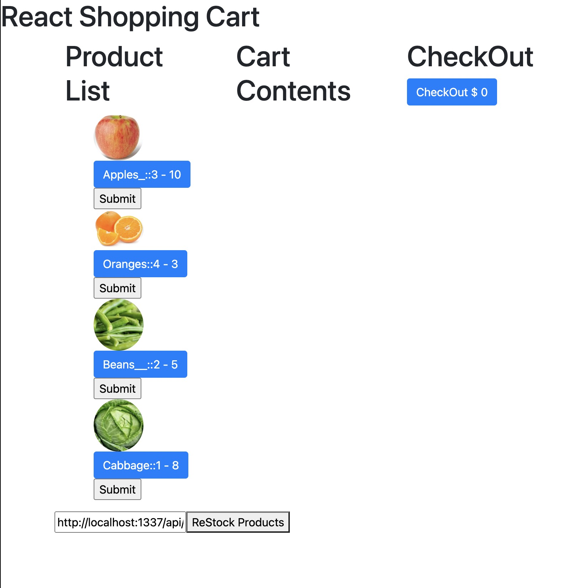

# Shopping-Cart

## Description

A shopping cart that keeps stock of the items avaliable.  
The cart allows the user to add and remove items from their cart, and displays a balance for the cart.
Build using Strapi as an API and database.
Postman used for API testing.

## Installation

1. Simply download the folder to your local machine or fork the project
2. Navigate to the root folder within the terminal
3. Run <code>npm install</code> and <code>npx http-server -c-1</code>.

The app will then open in your browser!

## Future Improvements

The cart will perminetly remove items from the cart when purchased.

## MIT License

Permission is hereby granted, free of charge, to any person obtaining a copy
of this software and associated documentation files (the "Software"), to deal
in the Software without restriction, including without limitation the rights
to use, copy, modify, merge, publish, distribute, sublicense, and/or sell
copies of the Software
  
